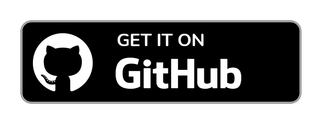
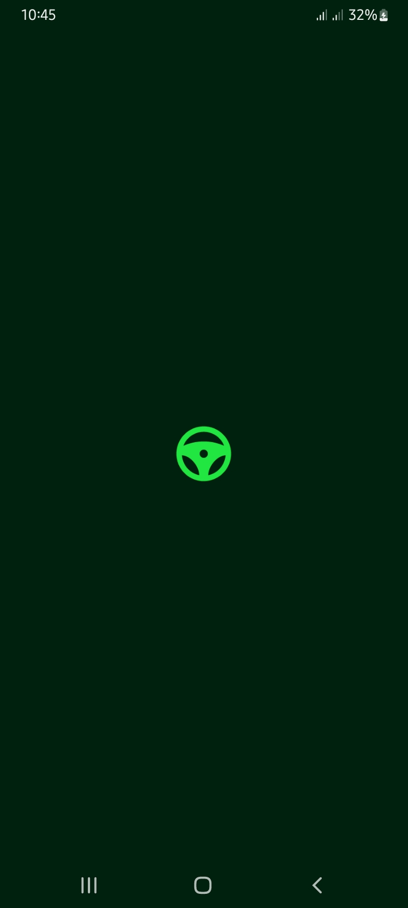
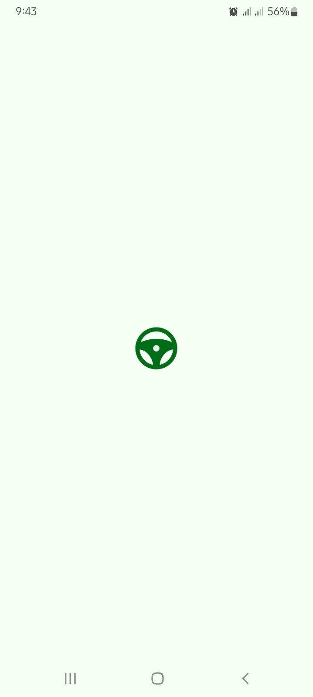
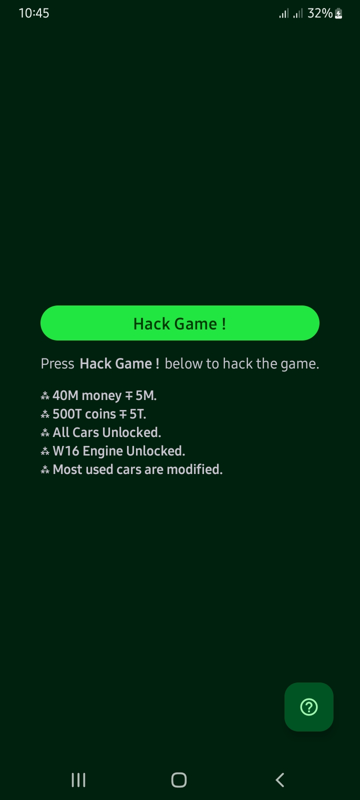
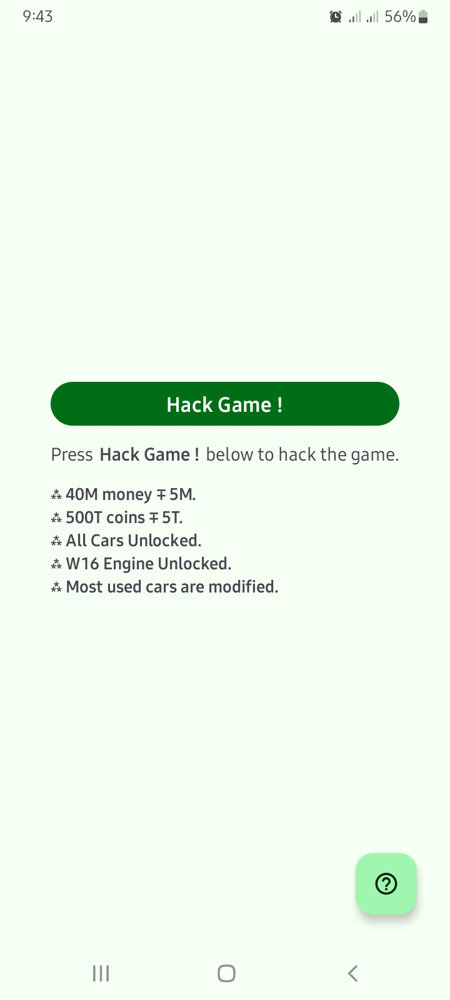
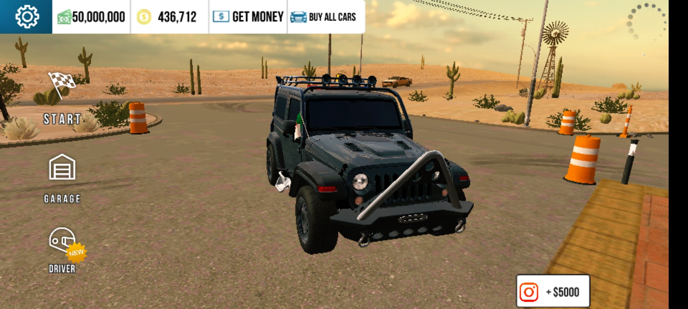
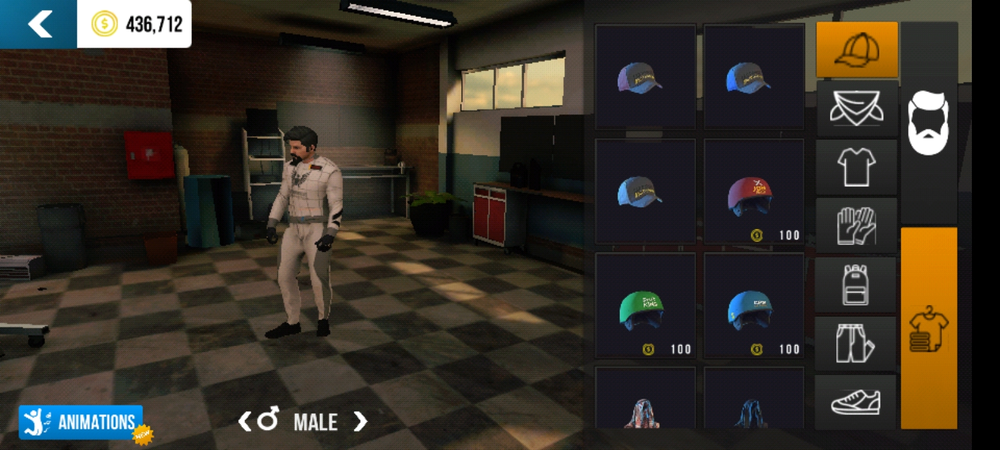

# About
By using CPMNuker, you can get coins, gold coins, and modified cars without the need to download a modified version of the game.
Just follow these steps:

- Root
    - Install `CPMNuker` form releases
    - Run It & Click `Hack Game !`
    - You're ready to go ;)

- UnRoot
    - Install `Multiple Accounts` from [play store](https://play.google.com)
    - Install `CPMNuker` form releases
    - Copy `Car Parking Multiplayer` to `Multiple Accounts`
    - Copy `CPMNuker` to `Multiple Accounts`
    - Run It & Click `Hack Game !`
    - You're ready to go ;)
    
```
Note: The game will not stop your account, nor will it put you on the hackers server!
```
    
## Download
<a href="https://github.com/itzAnasov/CPMNuker/releases/download/1.0/app-release.apk" target="_blank" rel="noopener noreferrer">
    
</a>

## Application ScreenShots

Dark theme                 |  Light theme
:-------------------------:|:-------------------------:
  | 
  | 


## Game ScreenShots

View 1                 |  View 2
:-------------------------:|:-------------------------:
   | 

### License
```
I disclaim my responsibility for any misuse of this application and that
the purpose of its programming was for educational reasons only.
```
```
MIT License

Copyright (c) 2022 Anas Ben Rahim (Anasov)

Permission is hereby granted, free of charge, to any person obtaining a copy
of this software and associated documentation files (the "Software"), to deal
in the Software without restriction, including without limitation the rights
to use, copy, modify, merge, publish, distribute, sublicense, and/or sell
copies of the Software, and to permit persons to whom the Software is
furnished to do so, subject to the following conditions:

The above copyright notice and this permission notice shall be included in all
copies or substantial portions of the Software.

THE SOFTWARE IS PROVIDED "AS IS", WITHOUT WARRANTY OF ANY KIND, EXPRESS OR
IMPLIED, INCLUDING BUT NOT LIMITED TO THE WARRANTIES OF MERCHANTABILITY,
FITNESS FOR A PARTICULAR PURPOSE AND NONINFRINGEMENT. IN NO EVENT SHALL THE
AUTHORS OR COPYRIGHT HOLDERS BE LIABLE FOR ANY CLAIM, DAMAGES OR OTHER
LIABILITY, WHETHER IN AN ACTION OF CONTRACT, TORT OR OTHERWISE, ARISING FROM,
OUT OF OR IN CONNECTION WITH THE SOFTWARE OR THE USE OR OTHER DEALINGS IN THE
SOFTWARE.
```
